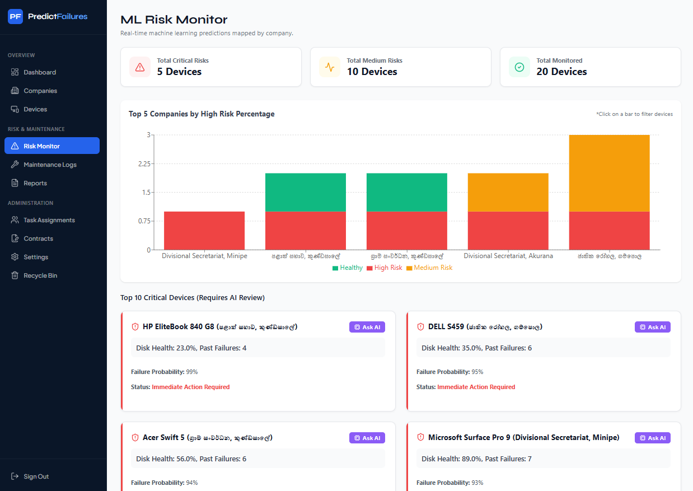
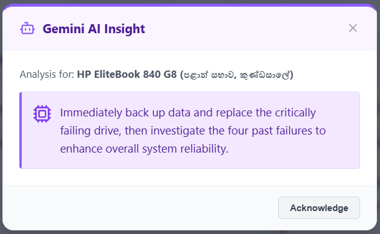

# ML-Powered Predictive Maintenance System

An advanced, full-stack predictive maintenance platform designed to monitor hardware health, predict potential failures using a custom Machine Learning model, and automate maintenance workflows.

Built with a robust **Django REST Framework** backend, a responsive **React** frontend, and powered by **Google Gemini AI** and **Supabase (PostgreSQL)**.

## Live Demo

- **Frontend:** https://ml-predictive-maintenance.vercel.app
- **Backend API:** https://ml-predictive-maintenance-server-wgt5.onrender.com/api/

## Table of Contents

- [Live Demo](#-live-demo)
- [High-Level System Architecture](#high-level-system-architecture)
- [Key Features](#key-features)
- [Machine Learning & AI Implementation (PoC)](#machine-learning--ai-implementation-poc)
- [UI Previews](#ui-previews)
- [Tech Stack](#tech-stack)
- [Project Structure](#project-structure)
- [Environment Variables Setup](#environment-variables-setup)
- [Local Setup & Installation](#local-setup--installation)
- [API Endpoints Documentation](#️-api-endpoints-documentation)
- [Challenges & Solutions](#challenges--solutions)
- [Future Improvements](#future-improvements)
- [Author](#author)
- [License](#license)

---

## High-Level System Architecture

_Figure 1: High-Level System Architecture connecting the React Client, Django API, ML Engine, and Gemini AI._

## Key Features

- **Custom ML Failure Prediction:** Utilizes a custom-trained Machine Learning model to evaluate hardware risk levels based on age, disk health, and historical data.
- **AI Maintenance Insights:** Integrates Google Gemini AI to analyze hardware metrics (CPU, Disk health, Past failures) and generate real-time maintenance advice.
- **Hardware Monitoring:** Tracks active devices, contract expirations, and overall system health.
- **Advanced Security:** Secure login with JWT authentication, Two-Factor Authentication (2FA/TOTP), and automated security email alerts.
- **Automated Workflows:** Auto-assigns technician tasks and runs background processes to check for 30-day contract expirations.
- **Email Notifications:** Real-time email alerts for task assignments, contract renewals, and security warnings.
- **Safe Deletion (Trash Manager):** Soft-delete implementation for Companies, Devices, Contracts, and Tasks with a centralized Trash Manager to restore or permanently delete records.

## Machine Learning & AI Implementation (PoC)

To demonstrate the full capability of the predictive pipeline without compromising real-world sensitive company data, the Machine Learning component is designed as a **Proof-of-Concept (PoC)**.

- **Simulated Hardware Datasets:** The Random Forest model was trained using algorithmically generated dummy data. This was a deliberate engineering choice to successfully validate the end-to-end data pipeline, model training, and dynamic prediction logic.
- **Generative AI Analysis:** The Google Gemini API reads these predictions and dynamically generates context-aware, natural language maintenance advice for technicians.

## UI Previews

### Risk Monitor Dashboard

### Gemini AI Insight Modal

## Tech Stack

**Frontend**

- **Framework:** React.js (Vite)
- **Styling:** Tailwind CSS / Custom CSS
- **Deployment:** Vercel

**Backend**

- **Framework:** Django & Django REST Framework (DRF)
- **Database:** Supabase (PostgreSQL)
- **Machine Learning:** Scikit-Learn / Joblib (Custom Model)
- **AI Engine:** Google GenAI SDK (Gemini 2.5 Flash)
- **Authentication:** SimpleJWT, PyOTP (For 2FA)
- **Deployment:** Render

## Project Structure

**Frontend Structure**
 

  

**Backend Structure**
 

## Environment Variables Setup

To run this project locally, you need to set up the following environment variables.

**Backend (`.env` file in the Django root)**

- `SECRET_KEY=your_django_secret_key`
- `DEBUG=False`
- `DATABASE_URL=postgresql://postgres:[PASSWORD]@[HOST]:6543/postgres?sslmode=require`
- `EMAIL_HOST_USER=your_smtp_email@example.com`
- `EMAIL_HOST_PASSWORD=your_smtp_password_or_app_password`
- `GEMINI_API_KEY=your_google_gemini_api_key`

**Frontend (`.env` file in the React root)**

- `VITE_API_URL=http://127.0.0.1:8000/api/`
  _(Note: Change this to your Render backend URL when deploying to production)._

## Local Setup & Installation

### Prerequisites

Before setting up the project locally, ensure you have the following installed:

- **Node.js** (v18 or higher)
- **Python** (v3.10 or higher)
- **Git**

**1. Clone the Repository**

- `git clone https://github.com/vihanga-anuththara/ml-predictive-maintenance.git`
- `cd ml-predictive-maintenance`

**2. Backend Setup**

- Navigate to the backend directory.
- Create a virtual environment: `python -m venv venv`
- Activate it: `source venv/bin/activate` (On Windows use: `venv\Scripts\activate`)
- Install dependencies: `pip install -r requirements.txt`
- Run migrations to sync with Supabase: `python manage.py migrate`
- Create an Admin account: `python manage.py createsuperuser`
- Start the development server: `python manage.py runserver`

**3. Frontend Setup**

- Navigate to the frontend directory.
- Install dependencies: `npm install`
- Start the development server: `npm run dev`

## API Endpoints Documentation

To keep this documentation concise, the complete API documentation (including request/response payloads, authentication headers, and core routes) has been moved to a separate file.

The complete REST API documentation is available in: API_DOCS.md

It includes:

- Authentication & Security
- Core Entities (CRUD)
- AI & Machine Learning
- System & Utilities

**[Click here to read the Full API Documentation](API_DOCS.md)**

## Challenges & Solutions

During the development of this system, several technical challenges were successfully navigated:

- **ML Model Integration in Django:** Bridging the gap between the Python-based Scikit-Learn model and the Django REST framework required careful serialization (using Joblib) to ensure fast and efficient real-time risk predictions without bottlenecking the API.
- **GenAI Context Tuning:** Fine-tuning the Google Gemini AI prompt to consistently return professional, structured, and strictly technical maintenance advice without hallucinations.
- **Complex Data State Management:** Implementing the Soft-Delete (Trash Manager) across highly relational database tables (Companies, Devices, Contracts, Tasks) without violating foreign key constraints.
- **Security & Authentication:** Implementing a seamless Two-Factor Authentication (2FA/TOTP) flow alongside JWT tokens, ensuring secure but user-friendly access control for technicians.

## Future Improvements

Given additional time and resources, the following features could be implemented:

- **IoT Integration:** Direct integration with IoT sensors installed on physical servers to feed live telemetry data (temperature, RPM) directly into the database.
- **Mobile Application:** A dedicated React Native mobile app for technicians to receive push notifications and update task statuses on the go.
- **Advanced ML Models:** Transitioning from Random Forest to Deep Learning models (such as LSTMs) to analyze time-series data for even more precise failure predictions.

## Author

**Vihanga Anuththara**

- **GitHub:** [@vihanga-anuththara](https://github.com/vihanga-anuththara)
- **LinkedIn:** [Vihanga Anuththara](https://www.linkedin.com/in/vihanga-anuththara)

Developed as the final-year project for the Higher National Diploma in Information Technology (HNDIT), demonstrating full-stack software engineering, machine learning integration, and secure REST API development.

## License

This project is licensed under the Apache License 2.0 - see the [LICENSE](LICENSE) file for details.
